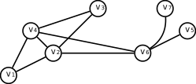
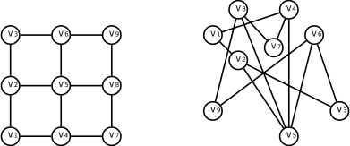
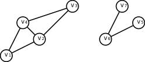
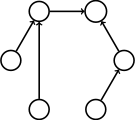
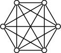
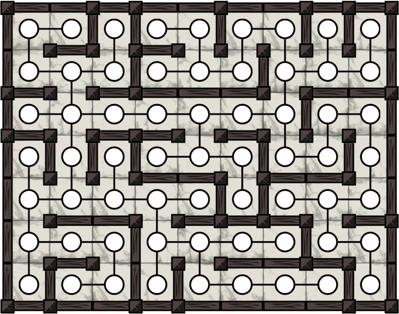

# Advanced Algorithmics and Graph Theory with Python

Course by IMTx NET04x

## Part 1: Fundamentals of Graph Theory Problem

Lesson: While Addressing a computation problem follow three steps:

- **Formalize:** express a problem using adapted terminology and concepts
- **Specify:** identify algorithms or methods that are well suited to solve the formalized problem.
- **Code:** once the problem is specified, it's time to start coding.

Lesson 2: Graphs and Paths

- Graph theory is a sub-field of discrete mathematics.
- Graphs can be used to represent the relationship between objects.
- A graph is composed of a set of vertices, $V$ and a set of edges, $E$.
- We can therefore refer to a graph a couple $G = (V, E)$ composed of $V$ and E.
- A graph is often depicted using circles for vertices and lines for edges.

Here, the set of verices is $V = {v1, v2,...,v7}$ and the set of edges is $E = {{v1,v2}, {v1,v4}, {v2,v3}, {v2,v4}, {v2,v6},...,{v6,v7}}$

The **order** of the graph is the number of vertices it contrains, which is $7$ in this example.

The **size of the graph** is the number of edges, which is 9 in this example.

Here are two graphs that appear to be different but are identical.

- Graphs we first introduced by Euler in 1736.
- He was interested in proving that no one could walk around the city of Konigsberg and cross each of its bridges exactly one time.
- To prove this, he showed that starting and finishing at one point would require the graph to contain 0 or 2 land masses with an odd number of bridges.
- Since Konigsberg land masses all contained an odd number of bridges, this route was impossible.

In some case, edges can be directed, which means that a vertex $u$ can be connected to a vertex $v$, even if $v$ is not connected to $u$.

## The adjacency matrix and weighted graphs

It is prefereable to index veritces from 1 to n, whci is the order of the graph. When vertices of the graph are indexed appropriately, an alternative way to represent a graph is to use a matrix.

Here's an example of a graph and it's coresponding adjacency matrix:

> **Note**
> Note that the adjecency matrix of a graph is always symmetric. This is not necessarily the case when considering digraphs.
> Adjacency matrices can be generalized to take values other thatn 0s and 1s, which allows **weighted graphs** to be defined. Example of a weighted graph is the distances between major cities in the US. Connection weights can be used to represent these distances.

## Paths and geodesc distances

A **path** is an ordered sequence of edges that are distinct from on other, and is obtained from a sequence of vertices by joining any two consecutive veritices in the corresponding edge. The two extreme vertices of the sequence are called the extremities of the path.

- Paths are often confused with **walks**.
- A walk is a sequence of vertices, such that any two consecutive vvertices forn an edge in the graph.
- The difference is that a path cannot appear twice.
- A **cycle** in a grpah is a path in which the extremeties are identical. For example, in the previous graph is a cycle obtained from the sequence of vertices
- The **length** of a path is the length of the sequence
- For weighted graphs, the length corresponds to the sum of the weights.
- Finally, a graph is said to be connected if, for any two vertices there exists a path having these vertices as extremities.

## Standard graphs

Some graphs are very useful because they appear in many situations. For example, we encouter trees all the time in file systems, sports tournaments and so on.

- **Trees** are connected graphs that are cycle-free.
- **Rooter trees** are connected graphs whose vertices hace a specific relationsip with one another.
- **Complete graph** is a standard graph that includes all possible edges. Often a good choice to test abilities or the computation tme of an algorithm that operates on graphs.
- **Mazes** can also be representedas graphs.

